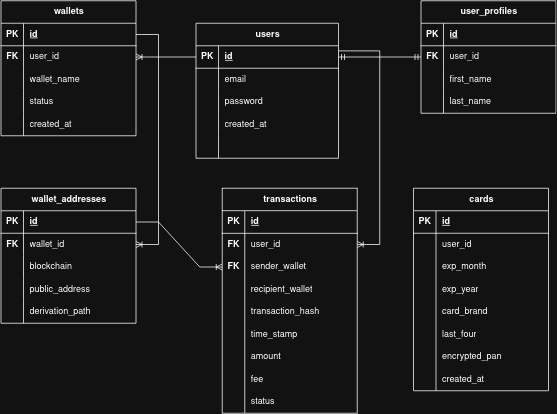
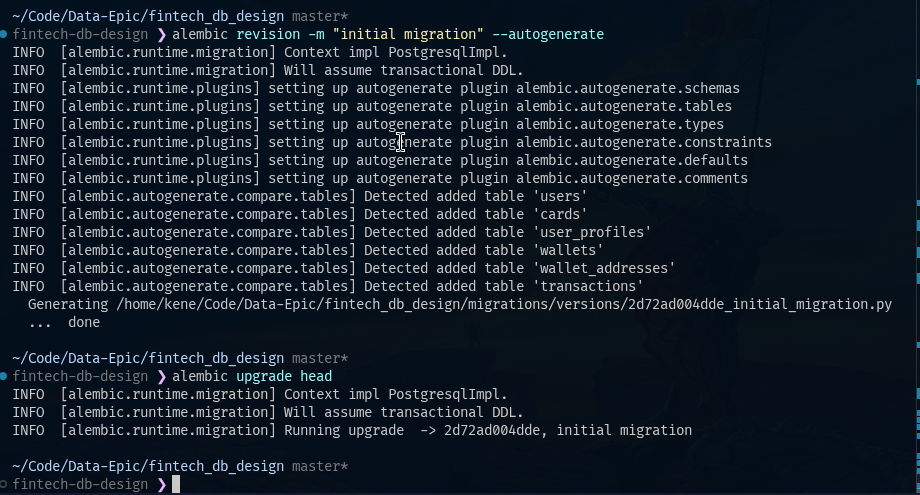
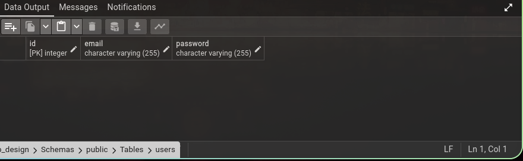
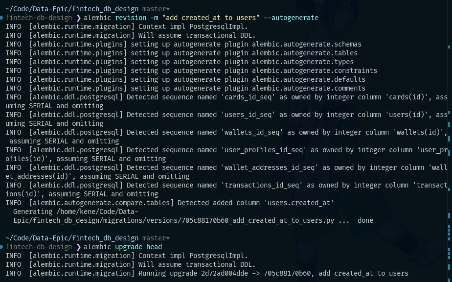
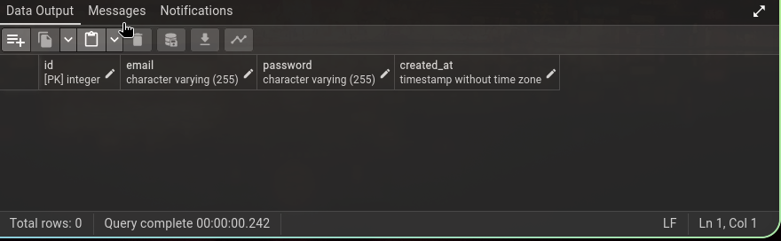
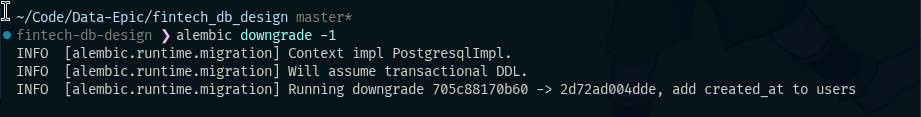
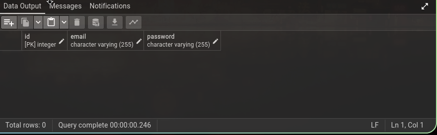

# Fintech DB Design 💳⚡

A robust, relational database architecture designed for fintech and crypto-wallet management platforms. Built using **SQLAlchemy 2.0 ORM**, **PostgreSQL**, **Alembic**, and **Docker Compose**.

---

## 📐 Key Design Decisions

The database schema was architected around security, flexibility, and real-world fintech/crypto paradigms:

* **No Card CVV Storage:** The `Card` table explicitly excludes Sensitive Authentication Data (SAD) like CVV/CVC codes. Storing CVVs after authorization violates **PCI-DSS compliance** standards. Only necessary card metadata (brand, expiration dates, last 4 digits, and encrypted PAN) is stored.
* **Non-FK Recipient Wallets:** In the `Transaction` model, `recipient_wallet` is stored as a standard string field rather than a foreign key constraint to internal `wallet_addresses`. This allows users to execute transfers to external blockchain addresses or third-party accounts not registered within the system database.
* **Separation of `Wallet` and `WalletAddress`:** Wallets and wallet addresses are decoupled into a **1-to-Many** relationship. A single user wallet can manage multiple public addresses (e.g., multi-chain support or fresh address generation per transaction for enhanced privacy).

---

## 🏗️ Architecture & Database Schema

The database models core fintech entities including user authentication, profiles, crypto wallets, blockchain addresses, transactions, and virtual/debit card details.



 

### Core Entities & Relationships
* **`User`**: Primary user account storing authentication details and timestamps.
* **`UserProfile`**: 1-to-1 extension holding user personal information (`first_name`, `last_name`).
* **`Wallet`**: Multi-wallet support per user with status tracking (`ACTIVE`, `IN REVIEW`, `INACTIVE`).
* **`WalletAddress`**: Multi-chain support mapped to a wallet with blockchain identifier (e.g., BTC, ETH) and public address.
* **`Transaction`**: Tracks user transactions, hash, amounts, network fees, and status (`PENDING`, `CONFIRMED`, `FAILED`).
* **`Card`**: Payment cards attached to users with encrypted PAN storage and validation constraints (`exp_month` between 1-12).

---

## 🚀 Tech Stack

* **Language:** Python 3.11+
* **ORM:** SQLAlchemy 2.0 (Strict Typing with `Mapped` and `mapped_column`)
* **Database Driver:** `psycopg2-binary`
* **Database:** PostgreSQL 17
* **Database Migrations:** Alembic
* **Database Management:** pgAdmin 4
* **Containerization:** Docker & Docker Compose

---

## 🛠️ Getting Started

### 1. Prerequisites
Make sure you have the following installed on your machine:
* Docker/ Docker Compose
* Python 3.11+

### 2. Environment Setup

Clone the repository and set up a virtual environment:

```bash
git clone [https://github.com/Kenn-stack/db_design.git](https://github.com/Kenn-stack/db_design.git)
cd db_design

# Install dependencies

uv sync

```


### 3. Running PostgreSQL & pgAdmin with Docker

Start the database and management interface in detached mode:

```bash
docker compose up -d

```

This starts two services:

* **PostgreSQL Server**: Available on `localhost:5432`
* **pgAdmin 4**: Accessible via browser at `http://localhost:5050`

---

## 🗄️ Database Initialization & Migrations

### Schema Evolution (Alembic)


```bash
# Generate a new migration revision
alembic revision -m "initial_migration" --autogenerate

```





# Apply pending migrations
```bash
alembic revision -m "add created_at to users" --autogenerate

alembic upgrade head

```





# Rollback a migration step
```bash
alembic downgrade -1

```





---

## 🗄️ Connecting pgAdmin to PostgreSQL

1. Open **`http://localhost:5050`** in your browser and log in with your pgAdmin credentials set in `docker-compose.yml`:
   * **Email:** `admin@admin.com` *(or your `PGADMIN_DEFAULT_EMAIL`)*
   * **Password:** *(your `PGADMIN_DEFAULT_PASSWORD`)*
2. Click **Add New Server**.
3. Under the **General** tab, set a name (e.g., `Fintech Local DB`).
4. Under the **Connection** tab, enter the database configuration:
   * **Host name/address:** `db` *(Docker service name)* or `postgres-epic`
   * **Port:** `5432`
   * **Maintenance database:** `db_design` *(matches `POSTGRES_DB`)*
   * **Username:** *(matches `POSTGRES_USER` in `.env` / `docker-compose.yml`)*
   * **Password:** *(matches `POSTGRES_PASSWORD` in `.env` / `docker-compose.yml`)*
5. Click **Save**.